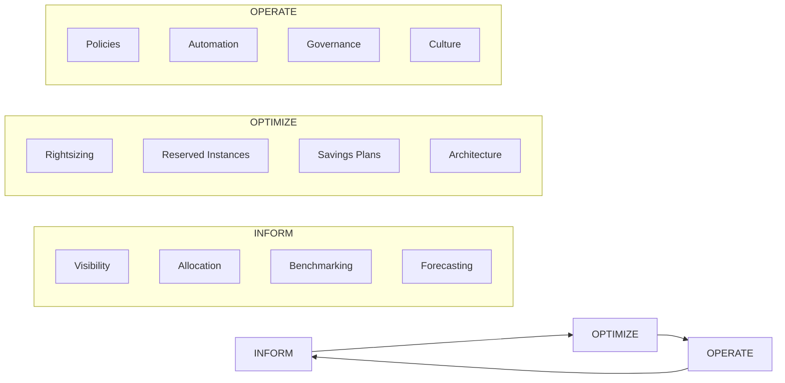

# 01 — FinOps Foundation

> *The framework behind every dollar saved. Most teams jump to tactics (cleanup scripts, rightsizing). The ones who save the most start here.*

---

## 📌 What Is FinOps?

FinOps is a cultural practice and operational framework that brings **financial accountability to cloud spending**. It unites Finance, Engineering, and Business teams around a shared goal: maximizing business value from every cloud dollar spent.

> **FinOps is NOT about cutting costs. It is about making informed tradeoffs between speed, quality, and cost.**

---

## 🔄 The FinOps Lifecycle



### Phase 1: Inform
- Establish **cost visibility** — who spends what, where, and why
- Set up tagging, cost allocation, and shared cost attribution
- Build dashboards for teams to see their own spend
- Enable forecasting and anomaly detection

### Phase 2: Optimize
- Eliminate waste (unused resources, zombie assets)
- Rightsize over-provisioned resources
- Purchase Reserved Instances and Savings Plans intelligently
- Architect for cost efficiency (not just performance)

### Phase 3: Operate
- Enforce policies via automation and guardrails
- Run FinOps governance meetings and reviews
- Build a FinOps culture where engineers own their costs
- Continuously improve through feedback loops

---

## 📊 FinOps Maturity Model

```
CRAWL (Level 1)              WALK (Level 2)              RUN (Level 3)
─────────────────────        ─────────────────────       ─────────────────────
• Basic cost visibility       • Team-level dashboards      • Real-time cost alerts
• Manual tagging              • Automated tagging           • Automated remediation
• Monthly cost reviews        • Weekly reviews              • Daily anomaly detection
• Single payer account        • Multi-account CUR           • Org-wide chargeback
• Spot/RI experimentation     • RI/SP strategy defined      • RI/SP fully automated
• Manual rightsizing          • Semi-automated sizing       • ML-driven rightsizing
• Engineering-only            • Eng + Finance aligned       • Eng + Finance + Business
• No cost in CI/CD            • Cost estimates in PRs       • Cost gates blocking deploy
• Tribal knowledge            • Runbooks written            • Self-service FinOps portal
```

**Self-Assessment Checklist:**
- [ ] All resources are tagged with owner, environment, cost center
- [ ] Teams can see their own costs without asking Finance
- [ ] Reserved Instance coverage > 70% for steady workloads
- [ ] Cost anomaly alerts fire within 4 hours of a spike
- [ ] Engineering PRs include infrastructure cost estimates
- [ ] Monthly chargeback reports are automated, not manual
- [ ] RI/SP recommendations are reviewed monthly
- [ ] Idle/zombie resources are caught within 72 hours

---

## 🏢 Enterprise FinOps Team Structure

```
                    ┌─────────────────────┐
                    │   VP / Director     │
                    │   Engineering       │
                    └─────────┬───────────┘
                              │
              ┌───────────────┼───────────────┐
              ▼               ▼               ▼
    ┌─────────────┐  ┌─────────────┐  ┌─────────────┐
    │  FinOps     │  │  Platform   │  │  Finance /  │
    │  Lead       │  │  Engineering│  │  Cloud Econ │
    │  (Architect)│  │  Team       │  │  Team       │
    └─────────────┘  └─────────────┘  └─────────────┘
           │                │                │
    ┌──────▼───────┐  ┌─────▼──────┐  ┌─────▼──────┐
    │ Cost Reviews │  │ Automation │  │ Showback / │
    │ RI Strategy  │  │ Guardrails │  │ Chargeback │
    │ Governance   │  │ IaC FinOps │  │ Forecasting│
    └──────────────┘  └────────────┘  └────────────┘
```

### RACI Matrix

| Activity | FinOps Lead | Platform Eng | App Team | Finance |
|---|---|---|---|---|
| Set cost allocation tags | A | R | C | I |
| Purchase Reserved Instances | A | C | I | R |
| Respond to cost anomalies | R | A | R | I |
| Define budget thresholds | C | I | I | A |
| Rightsize EC2/RDS | C | A | R | I |
| Approve Spot migration | A | R | C | I |
| Monthly cost review | A | R | R | R |
| FinOps tool selection | A | C | I | C |

*R=Responsible, A=Accountable, C=Consulted, I=Informed*

---

## 📈 Key FinOps KPIs

### Efficiency KPIs
| KPI | Formula | Target |
|---|---|---|
| RI Coverage Rate | RI-covered hours / Total On-Demand hours | > 70% |
| RI Utilization | Hours RI used / Hours RI available | > 90% |
| Savings Plan Coverage | SP-covered spend / Total eligible spend | > 80% |
| Waste Rate | Idle/unattached resource cost / Total cost | < 5% |
| Tagging Coverage | Tagged resources / Total resources | > 95% |
| Budget Variance | (Actual - Budget) / Budget | ±10% |

### Business KPIs (Unit Economics)
| KPI | Example Formula | Why It Matters |
|---|---|---|
| Cost per API Request | Monthly compute cost / Monthly API calls | SaaS pricing |
| Cost per Active User | Monthly cloud cost / MAU | Product profitability |
| Cost per Transaction | Infra cost / Transaction volume | Fintech/e-commerce |
| Cost per GB Processed | Data pipeline cost / GB processed | Data platforms |
| Cost per ML Training Run | SageMaker cost / Training jobs | AI/ML teams |
| Cloud Cost as % Revenue | Monthly cloud / Monthly revenue | Executive benchmark |

---

## 🔑 Core AWS Cost Management Services

| Service | Purpose | When to Use |
|---|---|---|
| **AWS Cost Explorer** | Visualize and analyze costs | Daily/weekly analysis |
| **Cost & Usage Report (CUR)** | Raw billing data (most granular) | Athena-based analytics |
| **AWS Budgets** | Alerts when spend exceeds thresholds | Budget governance |
| **Cost Anomaly Detection** | ML-based anomaly alerts | Real-time monitoring |
| **Compute Optimizer** | ML rightsizing recommendations | Quarterly reviews |
| **Trusted Advisor** | Cost, security, performance checks | Monthly health checks |
| **Billing Conductor** | Custom billing for internal teams | ISV/enterprise showback |
| **Cost Categories** | Group costs into logical categories | Chargeback |
| **Resource Groups + Tag Editor** | Tag management at scale | Tagging campaigns |
| **License Manager** | Track software licenses | Compliance + cost |

---

## 📋 FinOps Foundation Principles

1. **Teams need to collaborate** — Finance, Engineering, Product
2. **Everyone takes ownership** — Decentralized cost responsibility
3. **A centralized team drives FinOps** — Center of Excellence model
4. **FinOps reports accessible to all** — Transparency at every level
5. **Decisions are driven by the business value of cloud** — Not just cost minimization
6. **Take advantage of variable cost model** — Cloud elasticity is a feature

---

## 🔗 Further Reading

- [FinOps Foundation — Official Framework](https://www.finops.org/framework/)
- [FOCUS Specification](https://focus.finops.org/) — Open cloud billing standard
- [AWS Cloud Financial Management Guide](https://aws.amazon.com/aws-cost-management/)
- [FinOps Certified Practitioner Study Guide](https://learn.finops.org/)

---

*Next: [02 — Cost Optimization Strategy →](../02-Cost-Optimization/README.md)*
