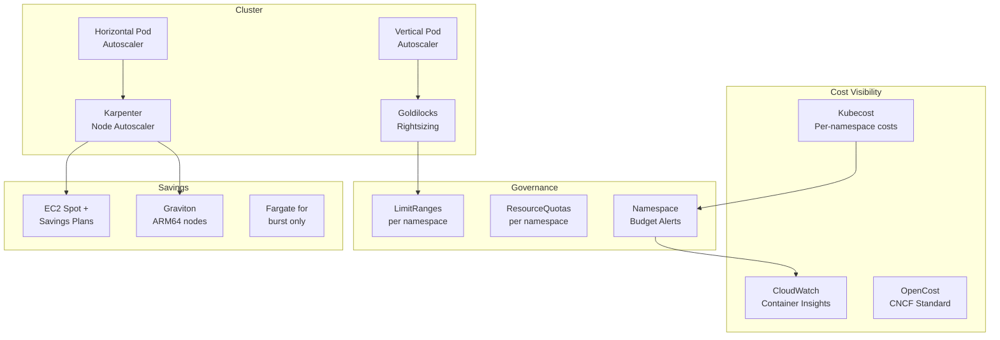

# 08 — EKS Cost Optimization

> *Kubernetes is the fastest way to waste cloud money at scale. Overprovisioning, forgotten jobs, idle pods, and missing resource limits silently consume 30–60% of cluster costs.*

---

## 💡 Why EKS Costs Spiral Out of Control

```
Common EKS Cost Anti-Patterns (Real Production Examples):

1. Developers set no resource requests → Kubernetes can't schedule efficiently
   → Worker nodes run at 10% utilization but 100% cost

2. Node groups are oversized to "be safe"
   → 32vCPU nodes running 2vCPU of actual workload
   → 90%+ of node capacity wasted

3. Team spun up a "test cluster" and forgot it
   → $15K/month for 6 months before anyone noticed

4. HPA min replicas set to 10 across 30 services
   → 300 pods running 24/7 for services with 10 RPS

5. No pod disruption budgets → Karpenter can't consolidate
   → Empty nodes can't be drained

6. Fargate used for everything, including long-running large workloads
   → Fargate: $0.04048/vCPU/hr vs EC2: $0.0085/vCPU/hr for m5.large
```

---

## 🏗️ EKS Cost Optimization Architecture



---

## ⚙️ Karpenter Configuration (Production-Grade)

### NodePool for Cost-Optimized Workloads

```yaml
# karpenter/nodepool-cost-optimized.yaml
apiVersion: karpenter.sh/v1beta1
kind: NodePool
metadata:
  name: cost-optimized
spec:
  template:
    metadata:
      labels:
        billing-team: platform
        node-pool: cost-optimized
    spec:
      requirements:
        - key: karpenter.sh/capacity-type
          operator: In
          values: ["spot", "on-demand"]  # Prefer spot
        - key: kubernetes.io/arch
          operator: In
          values: ["arm64", "amd64"]  # Allow Graviton
        - key: karpenter.k8s.aws/instance-family
          operator: In
          values: ["m5", "m5a", "m6g", "m6a", "r5", "r6g", "c5", "c6g"]
        - key: karpenter.k8s.aws/instance-size
          operator: NotIn
          values: ["nano", "micro", "small"]  # Avoid tiny nodes (overhead ratio bad)
        - key: topology.kubernetes.io/zone
          operator: In
          values: ["us-east-1a", "us-east-1b", "us-east-1c"]  # Multi-AZ for spot
      nodeClassRef:
        apiVersion: karpenter.k8s.aws/v1beta1
        kind: EC2NodeClass
        name: cost-optimized
  disruption:
    consolidationPolicy: WhenUnderutilized
    consolidateAfter: 30s  # Aggressive consolidation
    expireAfter: 720h       # Recycle nodes every 30 days
  limits:
    cpu: "1000"
    memory: 4000Gi
  weight: 10  # Lower weight = prefer this pool

---
apiVersion: karpenter.k8s.aws/v1beta1
kind: EC2NodeClass
metadata:
  name: cost-optimized
spec:
  amiFamily: AL2
  role: "KarpenterNodeRole-your-cluster"
  subnetSelectorTerms:
    - tags:
        karpenter.sh/discovery: your-cluster-name
  securityGroupSelectorTerms:
    - tags:
        karpenter.sh/discovery: your-cluster-name
  instanceStorePolicy: RAID0  # Use NVMe instance store if available
  blockDeviceMappings:
    - deviceName: /dev/xvda
      ebs:
        volumeSize: 50Gi
        volumeType: gp3
        iops: 3000
        throughput: 125  # gp3 baseline — no extra charge
        deleteOnTermination: true
  tags:
    env: production
    team: platform
    FinOps:ManagedBy: karpenter
```

### Spot NodePool for Batch Workloads

```yaml
# karpenter/nodepool-spot-batch.yaml
apiVersion: karpenter.sh/v1beta1
kind: NodePool
metadata:
  name: spot-batch
spec:
  template:
    spec:
      taints:
        - key: spot-batch
          value: "true"
          effect: NoSchedule
      requirements:
        - key: karpenter.sh/capacity-type
          operator: In
          values: ["spot"]  # SPOT ONLY for batch
        - key: karpenter.k8s.aws/instance-family
          operator: In
          values: ["m5", "m5a", "m5d", "m6i", "m6a", "m6id", "m7i", "m7a"]
        - key: karpenter.k8s.aws/instance-cpu
          operator: Gt
          values: ["4"]  # At least 4 vCPUs for batch efficiency
  disruption:
    consolidationPolicy: WhenEmpty
    consolidateAfter: 60s
  limits:
    cpu: "500"
```

---

## 📊 Namespace Resource Quotas & Limit Ranges

### LimitRange — Default Container Limits

```yaml
# governance/limitrange-default.yaml
# Apply to every namespace to prevent unbounded resource consumption
apiVersion: v1
kind: LimitRange
metadata:
  name: default-limits
  namespace: REPLACE_WITH_NAMESPACE
spec:
  limits:
    - type: Container
      default:              # Default limit if not specified
        cpu: "500m"
        memory: "512Mi"
      defaultRequest:       # Default request if not specified
        cpu: "100m"
        memory: "128Mi"
      max:                  # Maximum allowed
        cpu: "4"
        memory: "8Gi"
      min:                  # Minimum allowed
        cpu: "50m"
        memory: "64Mi"
    - type: Pod
      max:
        cpu: "16"
        memory: "32Gi"
    - type: PersistentVolumeClaim
      max:
        storage: "100Gi"   # Prevent runaway PVC allocation
```

### ResourceQuota — Namespace Budget

```yaml
# governance/resourcequota-team.yaml
apiVersion: v1
kind: ResourceQuota
metadata:
  name: team-budget
  namespace: team-payments
spec:
  hard:
    # Compute limits
    requests.cpu: "50"
    requests.memory: 100Gi
    limits.cpu: "200"
    limits.memory: 400Gi
    # Object count limits (prevents namespace sprawl)
    pods: "100"
    services: "20"
    persistentvolumeclaims: "20"
    # Storage limits
    requests.storage: 500Gi
    # Spot-only enforcement (optional)
    count/nodes: "0"  # Teams can't provision nodes directly
```

---

## 💰 Kubecost / OpenCost Setup

### OpenCost Helm Installation

```bash
# Install OpenCost (CNCF project — free and open source)
helm repo add opencost https://opencost.github.io/opencost-helm-chart
helm repo update

helm install opencost opencost/opencost \
  --namespace opencost \
  --create-namespace \
  --set opencost.exporter.cloudProviderApiKey="" \
  --set opencost.ui.enabled=true \
  --set opencost.prometheus.internal.enabled=true \
  --set opencost.customPricing.enabled=true \
  --set opencost.customPricing.configmapName=custom-pricing-model
```

### Custom Pricing ConfigMap

```yaml
# opencost/custom-pricing.yaml
apiVersion: v1
kind: ConfigMap
metadata:
  name: custom-pricing-model
  namespace: opencost
data:
  default.json: |
    {
      "provider": "aws",
      "description": "AWS EKS Custom Pricing for FinOps",
      "CPU": "0.031611",
      "spotCPU": "0.006655",
      "RAM": "0.004237",
      "spotRAM": "0.000892",
      "GPU": "0.95",
      "storage": "0.00004",
      "zoneNetworkEgress": "0.01",
      "regionNetworkEgress": "0.02",
      "internetNetworkEgress": "0.09",
      "defaultIdleMinCostPerHour": "0.0"
    }
```

### Querying Namespace Costs via OpenCost API

```python
# scripts/query_namespace_costs.py
"""
Queries OpenCost API to get per-namespace cost breakdown.
Useful for chargeback reporting.
"""
import requests
import json
from datetime import datetime, timedelta

OPENCOST_API = "http://opencost.opencost.svc.cluster.local:9003"

def get_namespace_costs(lookback_days: int = 30) -> dict:
    """Returns cost breakdown per namespace over the last N days."""
    end = datetime.utcnow().strftime("%Y-%m-%dT%H:%M:%SZ")
    start = (datetime.utcnow() - timedelta(days=lookback_days)).strftime("%Y-%m-%dT%H:%M:%SZ")

    url = f"{OPENCOST_API}/allocation"
    params = {
        "window": f"{start},{end}",
        "aggregate": "namespace",
        "accumulate": "true",
        "step": "1d",
        "format": "json"
    }

    response = requests.get(url, params=params, timeout=30)
    response.raise_for_status()
    data = response.json()

    namespace_costs = {}
    for allocation in data.get('data', [{}]):
        for ns, details in allocation.items():
            if ns == '__idle__':
                continue
            namespace_costs[ns] = {
                'total_cost_usd': round(details.get('totalCost', 0), 4),
                'cpu_cost_usd': round(details.get('cpuCost', 0), 4),
                'memory_cost_usd': round(details.get('ramCost', 0), 4),
                'storage_cost_usd': round(details.get('pvCost', 0), 4),
                'network_cost_usd': round(details.get('networkCost', 0), 4),
                'efficiency': round(details.get('totalEfficiency', 0) * 100, 1)
            }

    return dict(sorted(namespace_costs.items(), key=lambda x: x[1]['total_cost_usd'], reverse=True))

if __name__ == '__main__':
    costs = get_namespace_costs(30)
    print(f"\n{'Namespace':<35} {'Total $':<12} {'CPU $':<10} {'Mem $':<10} {'Efficiency':<12}")
    print("-" * 80)
    total = 0
    for ns, data in costs.items():
        print(f"{ns:<35} ${data['total_cost_usd']:<11.4f} ${data['cpu_cost_usd']:<9.4f} "
              f"${data['memory_cost_usd']:<9.4f} {data['efficiency']}%")
        total += data['total_cost_usd']
    print("-" * 80)
    print(f"{'TOTAL':<35} ${total:.4f}")
```

---

## 🔧 Goldilocks: VPA-Powered Rightsizing

```bash
# Install Goldilocks for automatic VPA-based rightsizing suggestions
helm repo add fairwinds-stable https://charts.fairwinds.com/stable
helm install goldilocks fairwinds-stable/goldilocks \
  --namespace goldilocks \
  --create-namespace

# Enable for a namespace
kubectl label namespace production goldilocks.fairwinds.com/enabled=true

# View recommendations
kubectl get verticalpodautoscaler -n production -o json | python3 -c "
import json, sys
data = json.load(sys.stdin)
for item in data['items']:
    name = item['metadata']['name']
    for c in item.get('status', {}).get('recommendation', {}).get('containerRecommendations', []):
        print(f'{name}/{c[\"containerName\"]}:')
        print(f'  Request CPU: {c[\"target\"][\"cpu\"]}')
        print(f'  Request Memory: {c[\"target\"][\"memory\"]}')
"
```

---

## 📋 EKS Cost Optimization Checklist

### Immediate Actions (Week 1)
- [ ] Install OpenCost or Kubecost to get per-namespace visibility
- [ ] Identify namespaces with efficiency < 30% (CPU wasted)
- [ ] Set up LimitRanges in every namespace
- [ ] Find pods with no resource requests set

### Short-Term (Month 1)
- [ ] Migrate node groups to Karpenter
- [ ] Enable Spot instances for non-production workloads
- [ ] Review HPA min replica counts — are they really needed?
- [ ] Set up namespace ResourceQuotas
- [ ] Enable Goldilocks for rightsizing recommendations

### Strategic (Quarter)
- [ ] Migrate eligible workloads to Graviton (arm64)
- [ ] Implement chargeback by namespace (cost center tags)
- [ ] Set up cluster auto-stop for dev/test clusters outside business hours
- [ ] Review Fargate usage — is it justified vs EC2?
- [ ] Enable cost anomaly alerts per namespace

---

## 🚨 Real Incident: EKS Cost Doubled Overnight

**Scenario:** EKS cluster monthly cost went from $45K to $90K in a single day.

**Root Cause:**
```bash
# Investigation steps:
# 1. Check Karpenter logs for sudden scale-out
kubectl logs -n karpenter -l app.kubernetes.io/name=karpenter | grep "launched node"

# 2. Find what caused the scale-out — what new pods were created?
kubectl get events --all-namespaces --sort-by='.lastTimestamp' | grep -i "FailedScheduling\|Scheduled" | tail -50

# 3. Check if a new deployment was rolled out
kubectl rollout history deployment -n production

# 4. Find pods with no limits (they'll get any available capacity)
kubectl get pods --all-namespaces -o json | python3 -c "
import json, sys
data = json.load(sys.stdin)
for pod in data['items']:
    for c in pod['spec']['containers']:
        if 'limits' not in c.get('resources', {}):
            print(f\"{pod['metadata']['namespace']}/{pod['metadata']['name']}/{c['name']}: NO LIMITS\")
"
```

**Resolution:**
1. Found a new batch job deployment with no resource limits and `replicas: 500` (typo, should have been 5)
2. Karpenter scaled out 50+ nodes in minutes
3. Fixed: Applied LimitRange, corrected replica count, terminated orphaned nodes

**Prevention:**
```yaml
# OPA Gatekeeper policy: Deny pods without resource limits
apiVersion: constraints.gatekeeper.sh/v1beta1
kind: K8sRequiredResources
metadata:
  name: require-resource-limits
spec:
  match:
    kinds:
      - apiGroups: [""]
        kinds: ["Pod"]
    excludedNamespaces: ["kube-system", "karpenter"]
  parameters:
    limits: ["cpu", "memory"]
    requests: ["cpu", "memory"]
```

---

*Back: [07 — Compute Optimization](../07-Compute-Optimization/README.md) | Next: [09 — Lambda Cost Optimization →](../09-Lambda-Cost-Optimization/README.md)*
