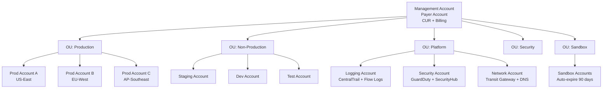

# 19 — Multi-Account FinOps

> *Single-account FinOps is easy. Multi-account FinOps at enterprise scale — with 50–500 accounts across multiple OUs — is where most teams fail.*

---

## 🏗️ AWS Organizations Cost Architecture



---

## 💰 Cost & Usage Report (CUR) — The Single Source of Truth

### Setting Up CUR (One-Time, in Management Account)

```hcl
# terraform/cur-setup/main.tf
# Must be deployed in us-east-1 in the management/payer account

resource "aws_s3_bucket" "cur_bucket" {
  bucket = "company-aws-cur-${var.account_id}"
  force_destroy = false

  tags = {
    FinOps      = "true"
    Purpose     = "Cost and Usage Report"
    Owner       = "platform-engineering"
  }
}

resource "aws_s3_bucket_lifecycle_configuration" "cur_lifecycle" {
  bucket = aws_s3_bucket.cur_bucket.id

  rule {
    id     = "move-to-intelligent-tiering"
    status = "Enabled"
    transition {
      days          = 90
      storage_class = "INTELLIGENT_TIERING"
    }
  }
}

resource "aws_cur_report_definition" "finops_cur" {
  report_name                = "finops-cur-hourly"
  time_unit                  = "HOURLY"          # Most granular
  format                     = "Parquet"          # Best for Athena
  compression                = "Parquet"
  additional_schema_elements = ["RESOURCES"]      # Include resource tags
  s3_bucket                  = aws_s3_bucket.cur_bucket.bucket
  s3_prefix                  = "cur"
  s3_region                  = "us-east-1"
  additional_artifacts       = ["ATHENA"]         # Auto-create Athena table
  refresh_closed_reports     = true               # Include corrections
  report_versioning          = "OVERWRITE_REPORT"

  depends_on = [aws_s3_bucket_policy.cur_bucket_policy]
}
```

### Athena CUR Table — Essential Queries

```sql
-- 1. Top 20 services by cost this month
SELECT
    line_item_product_code AS service,
    SUM(line_item_unblended_cost) AS total_cost_usd,
    SUM(line_item_usage_amount) AS total_usage
FROM "athenacurcfn"."finops_cur_hourly"
WHERE year = '2024' AND month = '06'
  AND line_item_line_item_type = 'Usage'
GROUP BY line_item_product_code
ORDER BY total_cost_usd DESC
LIMIT 20;

-- 2. Cost by account (multi-account view)
SELECT
    line_item_usage_account_id AS account_id,
    line_item_product_code AS service,
    SUM(line_item_unblended_cost) AS cost_usd
FROM "athenacurcfn"."finops_cur_hourly"
WHERE year = '2024' AND month = '06'
GROUP BY line_item_usage_account_id, line_item_product_code
ORDER BY cost_usd DESC;

-- 3. RI/SP coverage and savings
SELECT
    line_item_usage_account_id,
    reservation_reservation_arn,
    SUM(reservation_effective_cost) AS effective_cost,
    SUM(line_item_unblended_cost) AS list_cost,
    SUM(line_item_unblended_cost) - SUM(reservation_effective_cost) AS savings_usd
FROM "athenacurcfn"."finops_cur_hourly"
WHERE year = '2024' AND month = '06'
  AND line_item_line_item_type IN ('DiscountedUsage', 'RIFee')
GROUP BY line_item_usage_account_id, reservation_reservation_arn
ORDER BY savings_usd DESC;

-- 4. Daily spend trend (last 30 days)
SELECT
    DATE(line_item_usage_start_date) AS usage_date,
    SUM(line_item_unblended_cost) AS daily_cost_usd
FROM "athenacurcfn"."finops_cur_hourly"
WHERE year = '2024' AND month IN ('05', '06')
  AND line_item_line_item_type = 'Usage'
GROUP BY DATE(line_item_usage_start_date)
ORDER BY usage_date;

-- 5. Untagged resource spend (chargeback gap)
SELECT
    line_item_resource_id,
    line_item_product_code,
    SUM(line_item_unblended_cost) AS cost_usd
FROM "athenacurcfn"."finops_cur_hourly"
WHERE year = '2024' AND month = '06'
  AND (resource_tags_user_team IS NULL OR resource_tags_user_team = '')
  AND line_item_unblended_cost > 0
GROUP BY line_item_resource_id, line_item_product_code
ORDER BY cost_usd DESC
LIMIT 100;
```

---

## 🤖 Multi-Account Scanner Lambda

```python
# 25-Automation/lambda_functions/multi_account_scanner.py
"""
Org-wide waste scanner. Assumes cross-account IAM role in each member account.
Aggregates all waste findings into a unified weekly report.
Sends top-10 waste items to Slack and saves full report to S3.

Required: FinOpsReadOnlyRole must exist in all member accounts (see policies/)
"""

import boto3
import json
import logging
import os
from datetime import datetime, timezone
from typing import List, Dict, Any
import urllib.request

logger = logging.getLogger()
logger.setLevel(logging.INFO)

ORG_ROLE_NAME = os.environ.get('ORG_ROLE_NAME', 'FinOpsReadOnlyRole')
REPORT_BUCKET = os.environ.get('REPORT_S3_BUCKET', '')
SLACK_WEBHOOK = os.environ.get('SLACK_WEBHOOK_URL', '')
DRY_RUN = os.environ.get('DRY_RUN', 'True').lower() == 'true'

def get_org_accounts() -> List[Dict]:
    """Returns all active accounts in the AWS Organization."""
    org = boto3.client('organizations')
    accounts = []
    paginator = org.get_paginator('list_accounts')
    for page in paginator.paginate():
        for acct in page['Accounts']:
            if acct['Status'] == 'ACTIVE':
                accounts.append({
                    'id': acct['Id'],
                    'name': acct['Name'],
                    'email': acct['Email']
                })
    return accounts

def assume_role(account_id: str, role_name: str) -> Dict:
    """Assumes cross-account IAM role and returns credentials."""
    sts = boto3.client('sts')
    try:
        response = sts.assume_role(
            RoleArn=f"arn:aws:iam::{account_id}:role/{role_name}",
            RoleSessionName="FinOpsOrgScanner",
            DurationSeconds=3600
        )
        return response['Credentials']
    except Exception as e:
        logger.error(f"Cannot assume role in account {account_id}: {e}")
        return {}

def scan_account_eips(creds: Dict, account_id: str) -> List[Dict]:
    """Scans for unassociated Elastic IPs in an account."""
    findings = []
    kwargs = {
        'aws_access_key_id': creds['AccessKeyId'],
        'aws_secret_access_key': creds['SecretAccessKey'],
        'aws_session_token': creds['SessionToken']
    }

    ec2_global = boto3.client('ec2', region_name='us-east-1', **kwargs)
    regions = [r['RegionName'] for r in ec2_global.describe_regions()['Regions']]

    for region in regions:
        ec2 = boto3.client('ec2', region_name=region, **kwargs)
        try:
            addresses = ec2.describe_addresses()['Addresses']
            for addr in addresses:
                if not addr.get('AssociationId'):
                    findings.append({
                        'account_id': account_id,
                        'region': region,
                        'resource_type': 'Elastic IP',
                        'resource_id': addr.get('AllocationId', addr.get('PublicIp')),
                        'monthly_waste_usd': 3.60,
                        'action': 'Release unassociated EIP'
                    })
        except Exception as e:
            logger.error(f"EIP scan failed in {account_id}/{region}: {e}")

    return findings

def scan_account_volumes(creds: Dict, account_id: str) -> List[Dict]:
    """Scans for unattached EBS volumes in an account."""
    findings = []
    kwargs = {
        'aws_access_key_id': creds['AccessKeyId'],
        'aws_secret_access_key': creds['SecretAccessKey'],
        'aws_session_token': creds['SessionToken']
    }

    ec2_global = boto3.client('ec2', region_name='us-east-1', **kwargs)
    regions = [r['RegionName'] for r in ec2_global.describe_regions()['Regions']]

    for region in regions:
        ec2 = boto3.client('ec2', region_name=region, **kwargs)
        try:
            volumes = ec2.describe_volumes(
                Filters=[{'Name': 'status', 'Values': ['available']}]
            )['Volumes']
            for vol in volumes:
                size_gb = vol['Size']
                vol_type = vol['VolumeType']
                cost_per_gb = 0.08 if vol_type == 'gp3' else 0.10
                monthly_waste = size_gb * cost_per_gb
                findings.append({
                    'account_id': account_id,
                    'region': region,
                    'resource_type': 'EBS Volume',
                    'resource_id': vol['VolumeId'],
                    'monthly_waste_usd': round(monthly_waste, 2),
                    'action': f'Delete {size_gb}GB unattached {vol_type} volume'
                })
        except Exception as e:
            logger.error(f"Volume scan failed in {account_id}/{region}: {e}")

    return findings

def send_slack_report(findings: List[Dict], total_waste: float, account_count: int):
    """Sends org-wide waste summary to Slack."""
    if not SLACK_WEBHOOK:
        return

    top_findings = sorted(findings, key=lambda x: x['monthly_waste_usd'], reverse=True)[:10]

    lines = [
        f"• [{f['account_id']}] `{f['resource_id']}` ({f['resource_type']}) "
        f"in `{f['region']}` — **${f['monthly_waste_usd']}/mo** — {f['action']}"
        for f in top_findings
    ]

    msg = (
        f"📊 *Weekly Org-Wide FinOps Scan*\n"
        f"Scanned: {account_count} accounts\n"
        f"Total waste found: {len(findings)} resources | *${total_waste:,.2f}/mo*\n\n"
        f"*Top 10 waste items:*\n" + "\n".join(lines)
    )

    data = json.dumps({"text": msg}).encode('utf-8')
    req = urllib.request.Request(SLACK_WEBHOOK, data=data, headers={'Content-Type': 'application/json'})
    urllib.request.urlopen(req)

def lambda_handler(event, context):
    accounts = get_org_accounts()
    logger.info(f"Found {len(accounts)} accounts to scan")

    all_findings = []

    for account in accounts:
        account_id = account['id']
        logger.info(f"Scanning account: {account_id} ({account['name']})")

        creds = assume_role(account_id, ORG_ROLE_NAME)
        if not creds:
            logger.warning(f"Skipping account {account_id} — cannot assume role")
            continue

        eip_findings = scan_account_eips(creds, account_id)
        vol_findings = scan_account_volumes(creds, account_id)
        all_findings.extend(eip_findings + vol_findings)

        logger.info(f"Account {account_id}: {len(eip_findings)} EIPs + {len(vol_findings)} volumes")

    total_waste = sum(f['monthly_waste_usd'] for f in all_findings)
    logger.info(f"TOTAL ORG WASTE: {len(all_findings)} resources | ${total_waste:,.2f}/mo | ${total_waste * 12:,.2f}/yr")

    # Save full report to S3
    if REPORT_BUCKET:
        s3 = boto3.client('s3')
        report_key = f"finops-reports/{datetime.now(timezone.utc).strftime('%Y/%m/%d')}/org-scan-report.json"
        s3.put_object(
            Bucket=REPORT_BUCKET,
            Key=report_key,
            Body=json.dumps({
                'scan_date': datetime.now(timezone.utc).isoformat(),
                'accounts_scanned': len(accounts),
                'total_waste_monthly_usd': round(total_waste, 2),
                'total_waste_annual_usd': round(total_waste * 12, 2),
                'finding_count': len(all_findings),
                'findings': all_findings
            }, indent=2),
            ContentType='application/json'
        )
        logger.info(f"Report saved to s3://{REPORT_BUCKET}/{report_key}")

    send_slack_report(all_findings, total_waste, len(accounts))

    return {
        'statusCode': 200,
        'accounts_scanned': len(accounts),
        'findings_count': len(all_findings),
        'monthly_waste_usd': round(total_waste, 2),
        'annual_waste_usd': round(total_waste * 12, 2)
    }
```

---

## 🔐 Cross-Account IAM Roles

### FinOpsReadOnlyRole (Deployed to ALL Member Accounts)

```json
{
  "Version": "2012-10-17",
  "Statement": [
    {
      "Sid": "AllowFinOpsScanner",
      "Effect": "Allow",
      "Principal": {
        "AWS": "arn:aws:iam::MANAGEMENT_ACCOUNT_ID:role/FinOpsScannerRole"
      },
      "Action": "sts:AssumeRole",
      "Condition": {
        "StringEquals": {
          "sts:ExternalId": "finops-scanner-2024"
        }
      }
    }
  ]
}
```

### Deploy Cross-Account Role with StackSets

```hcl
# terraform/stackset/main.tf
# Deploy to all member accounts via AWS CloudFormation StackSets

resource "aws_cloudformation_stack_set" "finops_role" {
  name             = "FinOpsReadOnlyRole"
  description      = "Read-only role for centralized FinOps scanning"
  permission_model = "SERVICE_MANAGED"

  auto_deployment {
    enabled                          = true
    retain_stacks_on_account_removal = false
  }

  template_body = jsonencode({
    AWSTemplateFormatVersion = "2010-09-09"
    Resources = {
      FinOpsReadOnlyRole = {
        Type = "AWS::IAM::Role"
        Properties = {
          RoleName = "FinOpsReadOnlyRole"
          AssumeRolePolicyDocument = {
            Version = "2012-10-17"
            Statement = [{
              Effect    = "Allow"
              Principal = { AWS = "arn:aws:iam::${var.management_account_id}:role/FinOpsScannerRole" }
              Action    = "sts:AssumeRole"
            }]
          }
          ManagedPolicyArns = [
            "arn:aws:iam::aws:policy/ReadOnlyAccess",
            "arn:aws:iam::aws:policy/AWSCostAndUsageReportAutomationPolicy"
          ]
          Tags = [
            { Key = "Purpose", Value = "FinOps" },
            { Key = "ManagedBy", Value = "StackSet" }
          ]
        }
      }
    }
  })
}

resource "aws_cloudformation_stack_set_instance" "all_accounts" {
  stack_set_name = aws_cloudformation_stack_set.finops_role.name
  deployment_targets {
    organizational_unit_ids = var.target_ou_ids  # Deploy to all OUs
  }
  operation_preferences {
    max_concurrent_percentage    = 100
    failure_tolerance_percentage = 10
    region_order                 = ["us-east-1"]
  }
}
```

---

*Next: [20 — Enterprise FinOps →](../20-Enterprise-FinOps/README.md)*
