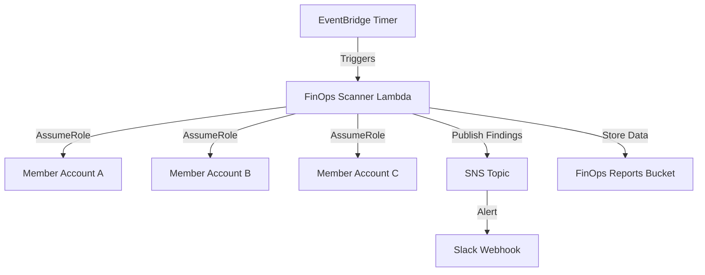

# 25 — FinOps Automation Scripts

> *Manual optimization is unsustainable. If a human has to click a button to save money, it won't happen. True FinOps relies on serverless automation to continuously detect and destroy waste.*

---

## 🤖 The Automation Library

This repository contains production-ready Python Lambda scripts designed to run on EventBridge schedules (e.g., daily or weekly) to automatically clean up cloud waste.

### Compute & Storage Waste
- **[Idle EC2 Detector](../07-Compute-Optimization/scripts/idle_ec2_detector.py):** Finds EC2 instances with <5% CPU for 14 days.
- **[EBS Volume Reaper](lambda_functions/ebs_volume_reaper.py):** Finds unattached EBS volumes, takes a final snapshot, and deletes them.
- **[EIP Cleanup](lambda_functions/eip_cleanup.py):** Releases Elastic IPs that are not attached to a running instance ($3.60/mo savings each).
- **[Snapshot Manager](lambda_functions/snapshot_manager.py):** Deletes EBS snapshots older than 90 days, or moves them to Archive tier.

### Platform & Advanced Waste
- **[NAT Gateway Auditor](../12-Network-Cost-Optimization/scripts/nat_gateway_analyzer.py):** Flags NAT gateways processing massive amounts of data, suggesting VPC endpoints.
- **[S3 Lifecycle Enforcer](../11-S3-Cost-Optimization/scripts/s3_lifecycle_enforcer.py):** Automatically applies Intelligent Tiering to buckets missing lifecycle rules.
- **[Multi-Account Scanner](../19-Multi-Account-FinOps/scripts/multi_account_scanner.py):** Assumes roles across an AWS Organization to run waste checks globally and report to Slack.
- **[Bedrock Circuit Breaker](../17-Bedrock-FinOps/scripts/bedrock_cost_guard.py):** Monitors LLM token spend and throttles access if hourly budgets are breached.

---

## 🏗️ Deployment Architecture

The recommended pattern is to deploy these scripts centrally in a **Shared Services / FinOps Account**, using Cross-Account IAM roles to scan the rest of the organization.

---

## ⚠️ Safety Defaults

All scripts in this repository use the `DRY_RUN = True` pattern by default.
- When `True`, they only scan and report (log to CloudWatch / Slack).
- You must explicitly set the environment variable `DRY_RUN = False` to allow the scripts to delete or modify resources.
