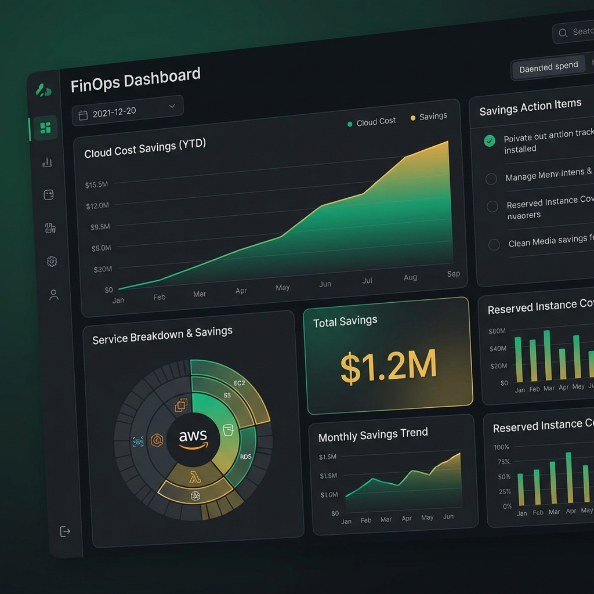

# 💰 AWS FinOps Automation

> Automated cloud financial management bots for resource optimization and waste reduction.

## 📈 Executive View

This repository provides highly scalable Boto3-based automation to detect, report, and remediate unoptimized AWS resources, potentially saving up to 30% on monthly cloud spend.

## 🤖 Core Bots

- **`cleanup_snapshots.py`**: Intelligent lifecycle management for EBS snapshots.
- **`orphan_volume_reaper.py`**: Automated detection of unattached EBS volumes.
- **`s3_lifecycle_auditor.py`**: Enforces Tiering/Lifecycle policies on S3 buckets.

## ⚙️ Configuration

1. Copy `.env.example` to `.env`
2. Set your AWS region and threshold values.
3. Run `make install`

---
"Cloud is expensive only if you let it be." — **Ramchandra Chintala**
