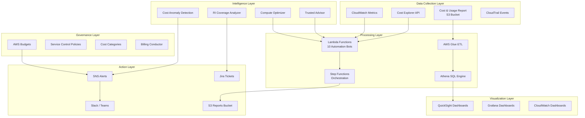

<div align="center">

# 🏦 AWS FinOps Automation Suite

### Principal-Grade Cloud Cost Engineering · Production-Ready · Enterprise-Scale

[](https://www.finops.org/)
[](https://aws.amazon.com/)
[](https://python.org/)
[](https://terraform.io/)
[](LICENSE)

**Built for Principal FinOps Architects · Platform Engineers · Cloud Economists · Engineering Leaders**

*The production-grade AWS FinOps resource that goes far beyond tutorials and generic cleanup scripts.*

</div>

---

## 🎯 Who This Repository Is For

This repository is designed for engineers and leaders who manage **real AWS infrastructure at scale**:

| Role | What You'll Get |
|---|---|
| **Principal FinOps Architect** | Reference architectures, governance frameworks, multi-account strategies |
| **Platform Engineer** | Production automation, Terraform modules, GitHub Actions pipelines |
| **Cloud Economist** | ROI models, unit economics, chargeback/showback frameworks |
| **SRE / DevOps Engineer** | Runbooks, anomaly detection, cost spike investigations |
| **Engineering Manager** | Executive dashboards, budget governance, team accountability models |
| **Interview Candidate** | 100+ scenario-based FinOps interview questions with expert answers |

---

## 🗂️ Repository Structure

```
aws-finops-automation/
├── 01-FinOps-Foundation/           # FinOps lifecycle, frameworks, maturity model
├── 02-Cost-Optimization/           # Core optimization strategies and decision trees
├── 03-Tagging-Strategy/            # Enterprise tagging governance and enforcement
├── 04-Cost-Allocation/             # Chargeback, showback, cost categories
├── 05-Budgets/                     # AWS Budgets, alerts, forecasting
├── 06-Cost-Anomaly-Detection/      # Real-time anomaly detection + response
├── 07-Compute-Optimization/        # EC2, ASG, Spot, Savings Plans, Compute Optimizer
├── 08-EKS-Cost-Optimization/       # Karpenter, Kubecost, namespace budgets
├── 09-Lambda-Cost-Optimization/    # Memory rightsizing, cold starts, provisioned concurrency
├── 10-RDS-Cost-Optimization/       # Instance rightsizing, Aurora Serverless, storage
├── 11-S3-Cost-Optimization/        # Intelligent Tiering, lifecycle policies, replication costs
├── 12-Network-Cost-Optimization/   # NAT GW, data transfer, VPC endpoints, PrivateLink
├── 13-Storage-Cost-Optimization/   # EBS, EFS, FSx rightsizing and lifecycle
├── 14-GPU-Cost-Optimization/       # P/G/Trn instances, spot GPU, utilization
├── 15-AI-ML-Cost-Optimization/     # LLM inference costs, vector DB, AI platform
├── 16-SageMaker-FinOps/            # Training jobs, endpoints, notebooks, pipelines
├── 17-Bedrock-FinOps/              # Token costs, model selection, caching
├── 18-Observability-Cost/          # CloudWatch, logs, metrics, tracing costs
├── 19-Multi-Account-FinOps/        # AWS Organizations, CUR, cross-account scanning
├── 20-Enterprise-FinOps/           # Governance, FinOps team structure, RACI
├── 21-Platform-FinOps/             # IDP integration, developer self-service, guardrails
├── 22-Kubernetes-FinOps/           # K8s resource quotas, LimitRanges, Goldilocks
├── 23-Terraform-FinOps/            # Cost estimation in CI/CD, Infracost
├── 24-GitHub-Actions/              # FinOps workflows, PR cost checks, auto-reports
├── 25-Automation/                  # 10 production Lambda bots + Step Functions
├── 26-Dashboards/                  # QuickSight, Grafana, CloudWatch dashboards
├── 27-Playbooks/                   # Incident runbooks for cost spikes and anomalies
├── 28-Case-Studies/                # Real enterprise cost incident post-mortems
└── 29-Interview-Questions/         # 100+ FinOps interview questions with expert answers
```

---

## 🏗️ System Architecture


```mermaid
graph TB
    subgraph "Data Collection Layer"
        CUR[Cost & Usage Report<br/>S3 Bucket]
        CE[Cost Explorer API]
        CW[CloudWatch Metrics]
        CT[CloudTrail Events]
    end

    subgraph "Processing Layer"
        ATH[Athena SQL Engine]
        GLU[AWS Glue ETL]
        LAM[Lambda Functions<br/>10 Automation Bots]
        SFN[Step Functions<br/>Orchestration]
    end

    subgraph "Intelligence Layer"
        CAD[Cost Anomaly Detection]
        CO[Compute Optimizer]
        TA[Trusted Advisor]
        RI[RI Coverage Analyzer]
    end

    subgraph "Action Layer"
        SNS[SNS Alerts]
        SLK[Slack / Teams]
        JIRA[Jira Tickets]
        S3R[S3 Reports Bucket]
    end

    subgraph "Governance Layer"
        BUD[AWS Budgets]
        SCP[Service Control Policies]
        CC[Cost Categories]
        BC[Billing Conductor]
    end

    subgraph "Visualization Layer"
        QS[QuickSight Dashboards]
        GF[Grafana Dashboards]
        CWDB[CloudWatch Dashboards]
    end

    CUR --> GLU --> ATH
    CE --> LAM
    CW --> LAM
    CAD --> SNS --> SLK
    LAM --> SFN --> S3R
    TA --> LAM
    CO --> LAM
    ATH --> QS
    BUD --> SNS
    RI --> JIRA
```

---

## 💥 Hidden Cost Leaks This Automation Catches

| Waste Category | Avg % of AWS Bill | Annual Savings (per $1M spend) |
|---|---|---|
| Orphaned EBS Volumes | 3–8% | $30K–$80K |
| Idle NAT Gateways | 5–10% | $50K–$100K |
| Over-provisioned RDS | 8–15% | $80K–$150K |
| RI/SP Coverage Gaps | 10–25% | $100K–$250K |
| Zombie Snapshots | 4–12% | $40K–$120K |
| CloudWatch Log Bloat | 3–7% | $30K–$70K |
| Cross-Region Data Transfer | 5–15% | $50K–$150K |
| Over-provisioned Lambda Memory | 2–5% | $20K–$50K |
| Untagged / Unowned Resources | 10–20% | $100K–$200K |
| GPU Idle Time | 15–40% (if AI workloads) | $150K–$400K |
| **Cumulative Recoverable** | **35–60%** | **$650K–$1.57M** |

---

## ⚡ Quick Start

```bash
# 1. Clone the repository
git clone https://github.com/ramcreddy-ch/aws-finops-automation
cd aws-finops-automation

# 2. Install dependencies
pip install -r requirements.txt

# 3. Configure AWS credentials
aws configure  # or export AWS_PROFILE=your-profile

# 4. Run in dry-run mode (safe — no deletions)
export DRY_RUN=True
python 25-Automation/lambda_functions/ebs_volume_reaper.py

# 5. View the RI coverage gap analysis
python 25-Automation/lambda_functions/ri_coverage_analyzer.py

# 6. Deploy full automation stack with Terraform
cd 23-Terraform-FinOps
terraform init && terraform plan
```

---

## 📊 Repository Sections At a Glance

### 🔵 Foundation & Strategy
| Section | Description | Key Files |
|---|---|---|
| [01 - FinOps Foundation](01-FinOps-Foundation/README.md) | Lifecycle, maturity model, team structure | Framework, RACI, KPIs |
| [02 - Cost Optimization](02-Cost-Optimization/README.md) | Decision trees, optimization hierarchy | Strategy, ROI models |
| [20 - Enterprise FinOps](20-Enterprise-FinOps/README.md) | Governance, operating model, executive reporting | Org design, policies |

### 🟠 Compute & Serverless
| Section | Description | Key Automations |
|---|---|---|
| [07 - Compute Optimization](07-Compute-Optimization/README.md) | EC2, ASG, Spot, RI/SP | `idle_ec2_detector.py` |
| [08 - EKS Optimization](08-EKS-Cost-Optimization/README.md) | Karpenter, namespace budgets, Kubecost | Helm values, KEDA config |
| [09 - Lambda Optimization](09-Lambda-Cost-Optimization/README.md) | Memory rightsizing, timeout tuning | `lambda_rightsizing.py` |

### 🟢 Data & Storage
| Section | Description | Key Automations |
|---|---|---|
| [10 - RDS Optimization](10-RDS-Cost-Optimization/README.md) | Rightsizing, Aurora Serverless | `rds_rightsizing.py` |
| [11 - S3 Optimization](11-S3-Cost-Optimization/README.md) | Tiering, lifecycle, replication | `s3_lifecycle_enforcer.py` |
| [13 - Storage Optimization](13-Storage-Cost-Optimization/README.md) | EBS, EFS, FSx lifecycle | `ebs_volume_reaper.py` |

### 🔴 AI/ML & GPU
| Section | Description | Key Content |
|---|---|---|
| [14 - GPU Optimization](14-GPU-Cost-Optimization/README.md) | P-series, Trn, spot GPU | Utilization dashboards |
| [15 - AI/ML Costs](15-AI-ML-Cost-Optimization/README.md) | LLM inference, vector DBs | Unit cost calculator |
| [16 - SageMaker FinOps](16-SageMaker-FinOps/README.md) | Training, endpoints, notebooks | Auto-shutdown scripts |
| [17 - Bedrock FinOps](17-Bedrock-FinOps/README.md) | Token pricing, model selection | Cost per query analyzer |

### 🟣 Governance & Multi-Account
| Section | Description | Key Content |
|---|---|---|
| [03 - Tagging Strategy](03-Tagging-Strategy/README.md) | Enterprise tags, enforcement, compliance | SCPs, Lambda enforcer |
| [04 - Cost Allocation](04-Cost-Allocation/README.md) | Chargeback, showback, cost categories | Athena queries, reports |
| [19 - Multi-Account](19-Multi-Account-FinOps/README.md) | Org-wide scanning, CUR aggregation | Cross-account IAM |

### 📋 Playbooks, Cases & Interviews
| Section | Description |
|---|---|
| [27 - Playbooks](27-Playbooks/README.md) | 15 incident response playbooks for cost spikes |
| [28 - Case Studies](28-Case-Studies/README.md) | Real post-mortems: NAT GW explosion, GPU waste, log costs |
| [29 - Interview Questions](29-Interview-Questions/README.md) | 100+ FinOps questions across 12 domains with expert answers |

---

## 🤖 The 10 Production Lambda Bots

All bots are in [`25-Automation/lambda_functions/`](25-Automation/lambda_functions/):

```
Bot                          Schedule          Est. Monthly Savings
─────────────────────────────────────────────────────────────────
ebs_volume_reaper.py         Daily 2AM         $500–$5,000
eip_cleanup.py               Daily 3AM         $50–$500
snapshot_manager.py          Daily 1AM         $1,000–$10,000
nat_gateway_auditor.py       Daily 6AM         $200–$3,000
rds_rightsizing.py           Weekly Monday     $2,000–$20,000
ri_coverage_analyzer.py      Weekly Sunday     Report only
anomaly_detector.py          Every 4 hours     Alert only
multi_account_scanner.py     Weekly Sunday     Aggregated report
lambda_rightsizing.py        Weekly Saturday   $100–$1,000
ecr_image_cleaner.py         Weekly Friday     $50–$500
```

---

## 🔐 Security & Compliance

All automation follows the **principle of least privilege**:
- **Read-only** IAM role for scanners
- **Separate remediation** IAM role for deletions (MFA-protected)
- All bots default to `DRY_RUN=True`
- CloudTrail logging for every action
- See [`policies/`](policies/) for all IAM policies

---

## 📚 References & Standards

- [FinOps Foundation Framework](https://www.finops.org/framework/)
- [AWS Well-Architected Cost Optimization Pillar](https://docs.aws.amazon.com/wellarchitected/latest/cost-optimization-pillar/)
- [AWS Cost Management Best Practices](https://docs.aws.amazon.com/cost-management/)
- [FOCUS - FinOps Open Cost & Usage Specification](https://focus.finops.org/)
- [Kubecost Documentation](https://www.kubecost.com/docs/)

---

<div align="center">

*"The cloud doesn't make you poor — ignorance of your cloud does."*
**— Ramchandra Chintala, Principal FinOps Architect**

⭐ **Star this repo if it saved you money** · 🍴 **Fork it to customize for your org**

</div>
